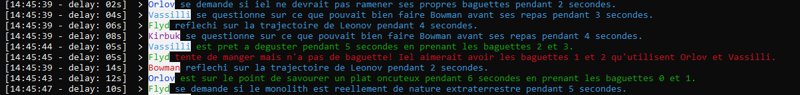
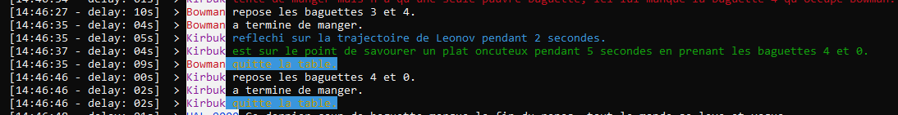

# **Dining Philosophers**

This program is a demo to a meal between 5 scientists.
The story is inspired by the book *"2010: Odyssey Two"*, from Arthur C. Clarke.

***Informations***
===
The program runs in Debug or Release, platform x64. 
You can directly compile it and use it.

It is a simulation of a dinner where every member act at the same time by using their own thread. 

The program asks the user these differents informations:
- The minimum thinking time of all wisemen.
- Their maximum thinking time.
- Their minimum eating time.
- Their maximum eating time.
- The count of wisemen.
- Their names for each one.

The program informs the user with the delay between the sending time and the display of each message ("delay ...").

It informs of all the actions made by the wisemen. When all the wisemen have finished, he informs about the duration of the meal.

**/!\ If some message are not lister chronological order it is because of speed of each thread. Some thread are faster than others. It results from a few anachronisms. /!\\**

**/!\ If the text display is broken, it is because the user is not in fullscreen mode. /!\\**

***Features***
===
Multi-threading:
---
The thread system is dead-lock and data race free. It uses lock_guard and mutex to avoid them.
The display uses a messages queue to avoid the display of multiple words at the same exact time.

Delayed text display:
---
The delayed display prints the characters of a string one by one and delay each print with the sleep_for STL function.

***Exemples***
===

Here are some examples of what you can see in the terminal.

Screenshot of the start of the meal

Screenshot of the members leaving the meal

***References***
===

Inspiration:
--
- *"2010: Odyssey Two"*:
https://en.wikipedia.org/wiki/2010:_Odyssey_Two

C++:
---

- C++ references:
https://en.cppreference.com/

- Give an idea how to generate random integers:
https://stackoverflow.com/questions/5008804/generating-random-integer-from-a-range/19728404#19728404

- Show how to use easily chronos : https://stackoverflow.com/questions/14391327/how-to-get-duration-as-int-millis-and-float-seconds-from-chrono